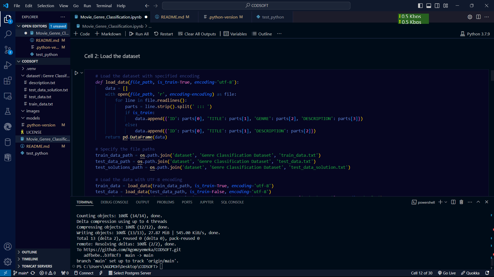

# CODSOFT
My Codesoft Task GIthub Repo For showcasing Machine Learning Projects I have worked on

# Movie Genre Classification Project


## Overview

Welcome to my movie genre classification project, completed as part of the CODSOFT machine learning internship(TASK 1). The goal of this project is to build a machine learning model that predicts the genre of a movie based on its plot summary. We will be using various machine learning techniques including Naive Bayes, Logistic Regression, Support Vector Machines, Random Forest, and Gradient Boosting.



## Table of Contents

- [Overview](#overview)
- [Dataset](#dataset)
- [Features](#features)
- [Models](#models)
- [Evaluation](#evaluation)
- [Data Preprocessing](#Data_Preprocessing)
- [Model Training and Evaluation](#Model_Training_and_Evaluation)
- [Visualizations](#Visualizations)
- [Installation](#installation)
- [Usage](#usage)
- [Results](#results)
- [Conclusion](#conclusion)
- [Author](#author)

## Dataset

The dataset used in this project is sourced from Kaggle and contains plot summaries and their corresponding genres. You can find the dataset [here](https://www.kaggle.com/datasets/hijest/genre-classification-dataset-imdb).

## Features

- **Plot Summary**: Textual description of the movie plot.
- **Genre**: The target variable indicating the genre of the movie.

## Models

The following machine learning models were used in this project:

1. **Naive Bayes**
2. **Logistic Regression**
3. **Support Vector Machine (SVM)**
4. **Random Forest** (ensemble model)
5. **Gradient Boosting** (ensemble model)

## Evaluation

The models were evaluated using accuracy, classification reports, and confusion matrices. Hyperparameter tuning, Train ensemble models and cross-validation were also performed to ensure the robustness of the models.

## Data Preprocessing

Text data is preprocessed by converting to lowercase, removing punctuation, tokenizing, and removing stopwords.

## Model Training and Evaluation

Multiple models are trained, evaluated, and compared. Below is the confusion matrix for the Logistic Regression model:


## - [Evaluation](#evaluation)

Various visualizations are created to analyze the model's performance:


## Installation

To run this project locally, follow these steps:

1. **Clone the Repository**:

    ```bash
    git clone https://github.com/Agomzyemeka/CODSOFT.git
    cd CODSOFT
    ```

2. **Install Dependencies**:

    Create a virtual environment and install the necessary dependencies.

    .A Create a virtual environment:
    ```bash
    python -m venv venv
    ```

    .B Activate the virtual environment:
    
    - On Windows:
    ```bash
    venv\Scripts\activate
    ```
    
    - On macOS/Linux:
    ```bash
    source venv/bin/activate
    ```

    .C Install the necessary packages:
    ```bash
    pip install -r requirements.txt
    ```

    .D Ensure your Jupyter notebook uses the correct kernel:
    ```bash
    python -m ipykernel install --user --name=venv
    ```
    
    OR

    Start Jupyter Notebook:
    ```bash
    jupyter notebook
    ```

    Select the `venv` kernel in Jupyter Notebook:
    - Open your Jupyter Notebook.
    - Click on `Kernel` > `Change kernel` > `venv`.

    _Note: Ensure you have a `requirements.txt` file listing all the necessary libraries._

## Usage

1. **Open the Notebook**:

    Navigate to the `notebooks` directory and open the `movie_genre_classification.ipynb` file in Google Colab or Jupyter Notebook.

2. **Run the Notebook**:

    Follow the steps in the notebook to preprocess the data, train the models, and evaluate their performance.

3. **Save the Models**:

    The trained models are saved in the `models` directory.

4. **View Results**:

    The evaluation results and visualizations are displayed in the notebook.

## Results

The performance of each model was evaluated based on accuracy and other metrics. The results are summarized in the notebook and visualized using confusion matrices.

## Conclusion

This project demonstrates the use of various machine learning techniques for text classification tasks. By comparing different models and using ensemble methods, we achieved robust predictions for movie genre classification.

## Author

**Chukwuemeka Agomoh**

Feel free to contact me on [LinkedIn](https://www.linkedin.com/in/chukwuemeka-agomoh-68726524b) or via email at emyagomoh54321@gmail.com for any questions or collaborations.

## Images

### Machine Learning


### Movies


### Genres


### GitHub

